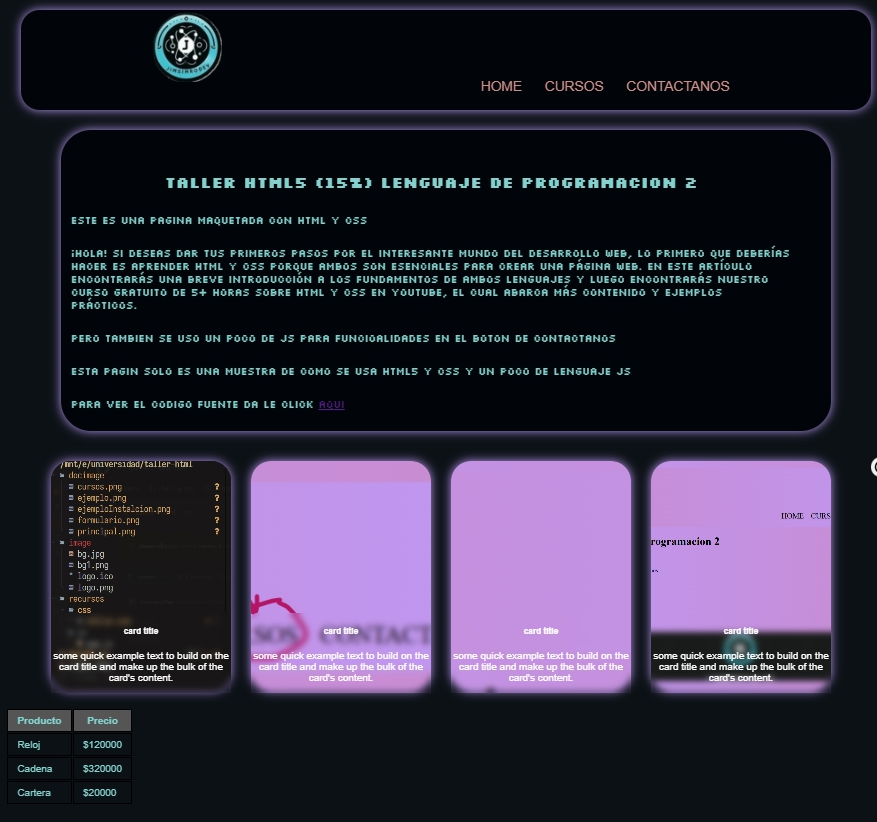
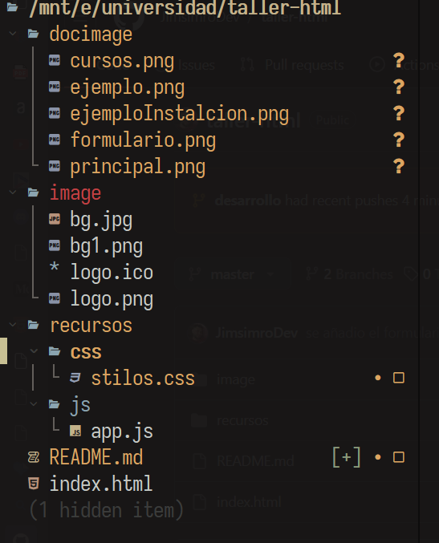
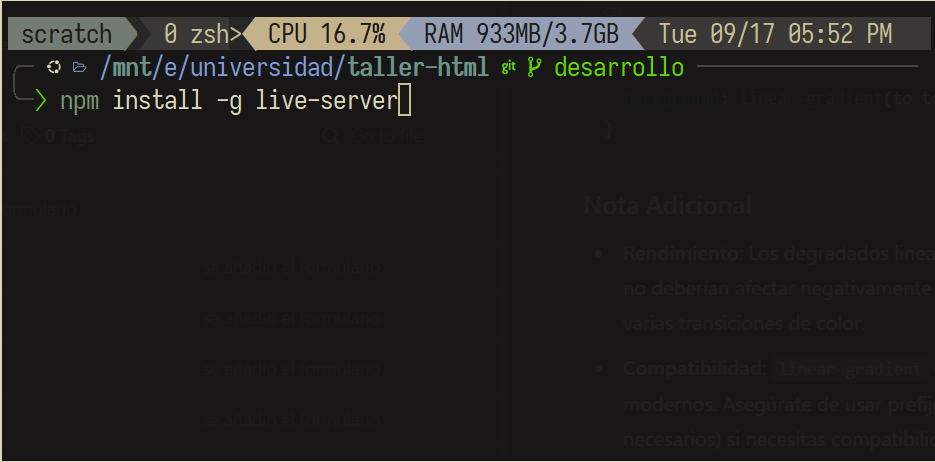
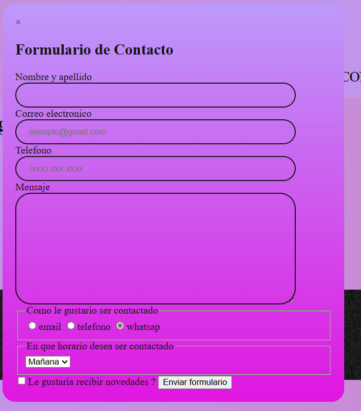

# Taller de html5 (15%) Lenguaje de programacion
>[!TIP] pagina principal

## Estructura del proyecto


 el directorio docimage contiene las imagenes de la documentacion, el el directorio recursos contien otros subdirectorios
con los estilo y el js para darle un poco de funcionalidad, el directorio image contien las imagenes usadas en la pagina
y el index.html es la pagina principal

## Dodumentación para devs
> [!NOTE]
> Para descargar el proyecto o codigo fuente usa el comando
>```
>git clone https://github.com/JimsimroDev/taller-html
>```

>[!TIP]
 Si tienes node isntalado puede ejecutar el comando
>```
> npm install -g live-server
>```
dentro de la carpeta raiz del proyecto,
ejemplo 

así puedes ejecutar el proyecto en local con el comando
>```
>live-server
>```

> [!TIP]
en parte de cursos al darle click envia a una pagina externa de la Remington


### Cuando se le de click en contactanos te mostrara el siguiente formulario



# Tecnologias usadas


